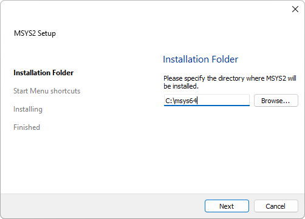

# 如何使用vscode创建一个c++项目
官方链接：<https://code.visualstudio.com/docs/cpp/config-mingw>
### 一、在vscode安装C/C++拓展

安装 VS 代码的 C/C++ 扩展。您可以通过在“扩展”视图 （Ctrl+Shift+X） 中搜索“c++”来安装 C/C++ 扩展。

### 二、通过 MSYS2 获取最新版本的 Mingw-w64
#### 1.先下载MSYS2
既可以从官网下载：<https://www.msys2.org/>

也可以从此链接直接下载：<https://github.com/msys2/msys2-installer/releases/download/2022-06-03/msys2-x86_64-20220603.exe>
下载完成后运行安装程序：

可以修改路径，其他的全部默认就行
下载完成后打开msys2

#### 2.通过 MSYS2 获取最新版本的 Mingw-w64
输入命令
>pacman -S mingw-w64-x86_64-gcc

#### 3.安装mingw-w64工具链
安装明w-w64工具链（）。在 MSYS2 终端中运行该命令。接受默认设置以安装组中的所有成员
输入命令
>pacman -S --needed base-devel mingw-w64-x86_64-toolchain

#### 4.将mingw-w64文件夹的路径添加到 Windows 环境变量
通过使用以下步骤，将明w-w64文件夹的路径添加到 Windows 环境变量：binPATH

在窗口搜索栏中，键入“设置”以打开您的窗口设置。
搜索“编辑帐户的环境变量”。
在“用户变量”中选择变量，然后选择“编辑”。Path
选择“新建”并将 Mingw-w64 目标文件夹路径添加到系统路径。确切的路径取决于您安装的Mingw-w64版本以及安装位置。如果您使用上述设置来安装 Mingw-w64，请将其添加到路径：。C:\msys64\mingw64\bin
选择“确定”以保存更新后的路径。您需要重新打开所有控制台窗口，新的 PATH 位置才可用。

#### 5.检查安装
打开新的cmd
输入
>gcc --version
g++ --version
gdb --version

得到

### 三、创建一个helloworld

#### 1.创建项目存放的文件夹
在 Windows 命令提示符下，创建一个名为projects的空文件夹，您可以在其中放置所有 VS Code 项目。然后创建一个名为helloworld的子文件夹，导航到该文件夹，并通过输入以下命令打开该文件夹中的 VS Code：projects helloworld
输入
>mkdir projects
cd projects
mkdir helloworld
cd helloworld
code .

“code .”命令在当前工作文件夹中打开 VS Code，该文件夹将成为您的“工作区”。通过选择“是，我信任作者”来接受“工作区信任”对话框，因为这是您创建的文件夹。

您将看到在工作区的文件夹中创建了三个文件：.vscode

>tasks.json（构建说明）
launch.json（调试器设置）
c_cpp_properties.json（编译器路径和智能感知设置）

#### 2.添加源代码文件
在“文件资源管理器”标题栏中，选择“新建文件”按钮并将文件命名为 。main.cpp

现在粘贴此源代码：
>#include <iostream>
>#include <vector>
>#include <string>
>
>using namespace std;
>
>int main()
>{
>    vector<string> msg {"Hello", "C++", "World", "from",   "VS Code", "and the C++ extension!"};
>
>    for (const string& word : msg)
>    {
>        cout << word << " ";
>    }
>    cout << endl;
>}

如图所示

### 四、运行main.cpp
请记住，C++扩展使用计算机上安装的C++编译器来生成程序。在尝试在 VS Code 中运行和调试之前，请确保已安装C++编译器。main.cpp

打开，使其成为活动文件。main.cpp

按编辑器右上角的按钮。

从系统上检测到的编译器列表中选择“C/C++： g++.exe生成和调试活动文件。

只有在首次运行 时，系统才会要求您选择编译器。此编译器将设置为文件中的“默认”编译器。

生成成功后，程序的输出将显示在集成的终端中

首次运行程序时，C++扩展将创建 ，您可以在项目的文件夹中找到该扩展。 存储生成配置。tasks.json

您的新文件应类似于下面的 JSON：tasks.json

>command:
该设置指定要运行的程序;在这种情况下，这是g ++。该数组指定将传递给 g++ 的命令行参数。这些参数必须按编译器预期的顺序指定。

>args:
此任务告诉 g++ 获取活动文件 （），对其进行编译，并在当前目录 （） 中创建一个与活动文件同名但扩展名 （） 的可执行文件，从而生成我们的示例。
该值是您将在任务列表中看到的值;你可以随心所欲地命名它。label

>detail:
该值是您将在任务列表中作为任务描述的值。强烈建议重命名此值，以将其与类似任务区分开来。

>从现在开始，播放按钮将从中读取，以弄清楚如何构建和运行程序。您可以在 中定义多个生成任务，无论哪个任务被标记为默认任务，播放按钮都将使用。如果需要更改默认编译器，可以运行任务：配置默认生成任务。或者，您可以通过替换以下段来修改文件并删除默认值：tasks.json

>  "group": {
        "kind": "build",
        "isDefault": true
    },
改成：
    "group": "build",